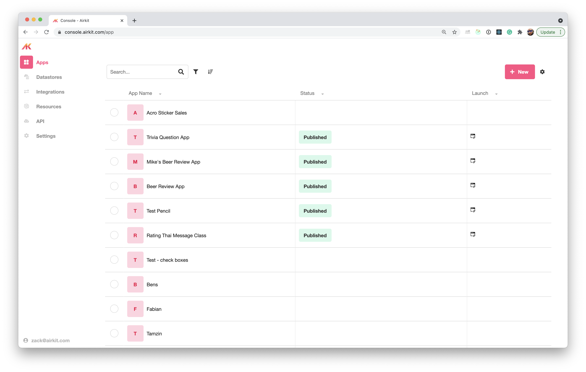

# Airkit Book

Website: airkit-book.com

## ROUGH TOC

* [Introduction](#intro)
* Where to use Airkit
* [Advantages of Airkit over other platforms](#airkitAdvantages)
* [Journeys](#journeys)
* Actors
* The Studio
	* Builders
* The Console
* Deployments
* Resources
* Integrations
* Journey Builder
* App Builder
	* Components
* Connection Builder

## Introduction {#intro}

Airkit is a collection of tools that allow developers to create rich, omni-channel experiences for the last mile of customer interaction. Between the studio and infrastructure, Airkit is a set of tools for anyone who wants to create fantastic customer experiences.

### This Book
This book is designed to be a manual to help one get up and running with Airkit. We will discuss the framework and platform in a somewhat linear fashion building concepts on each other until we have a comprehensive understanding of the platform and Airkit applications. 

Building a book like this requires a ton of help. The Airkit platform is constantly improving as well. This may mean that certain parts of the book may become outdated. Please email zack@airkit.com or support@airkit.com with questions or errata.

###  Who is this book for?
This book is designed for people looking to learn about Airkit. Some sections will be less technical than others but in order to get the more complicated concepts some front end development experience may help. 

Testing an image 

<!--  -->

## Where to Use Airkit {#whyUseAirkit}

## Airkit Advantages {#airkitAdvantages}

## Journeys {#journeys}