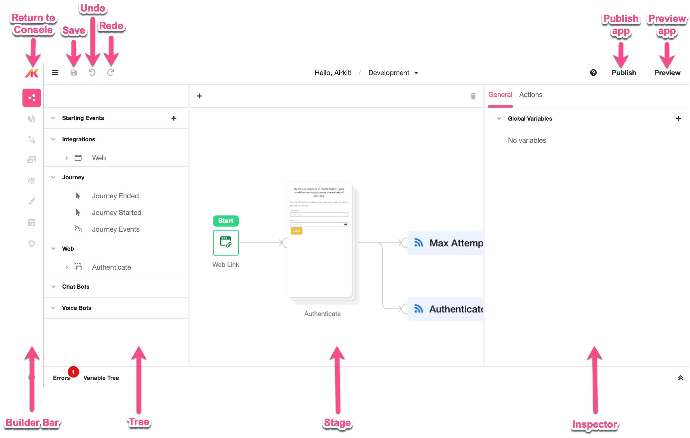
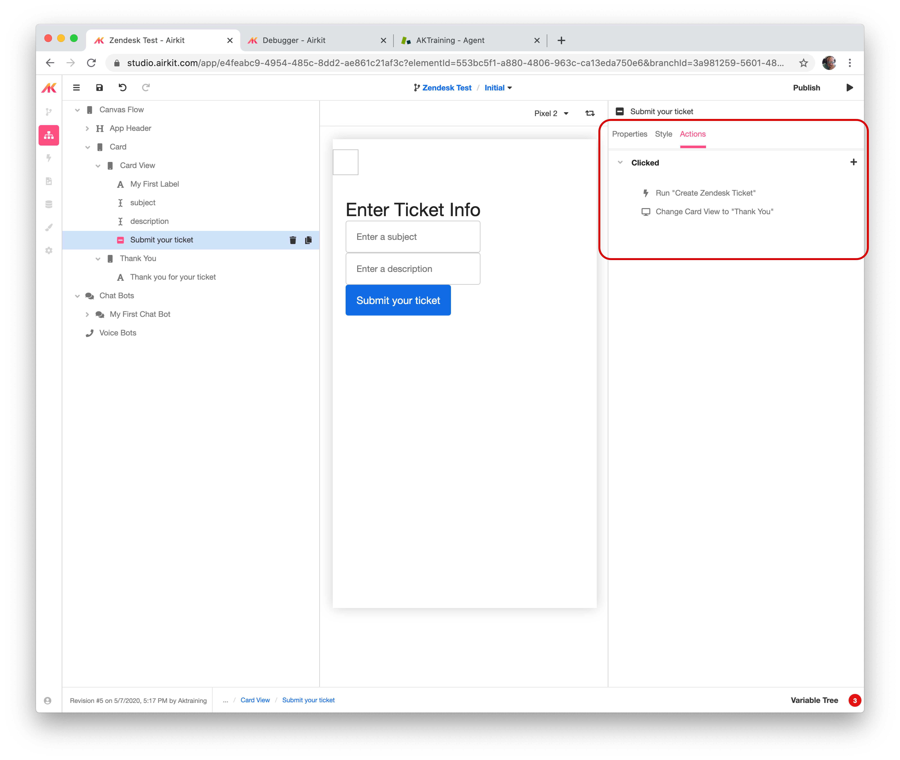
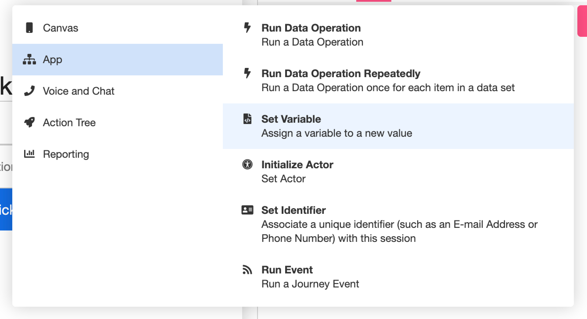
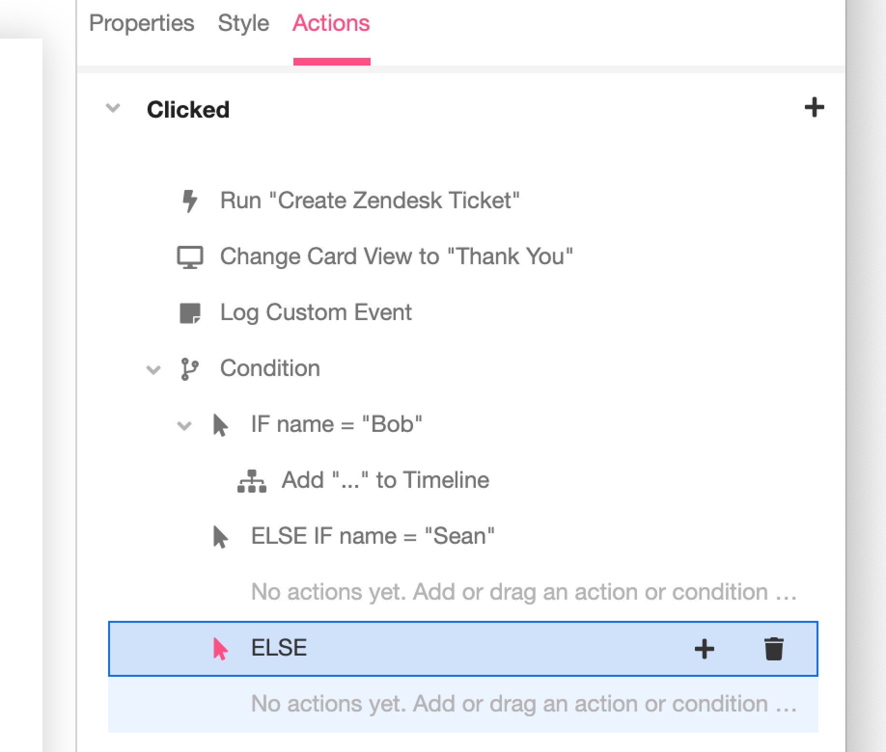
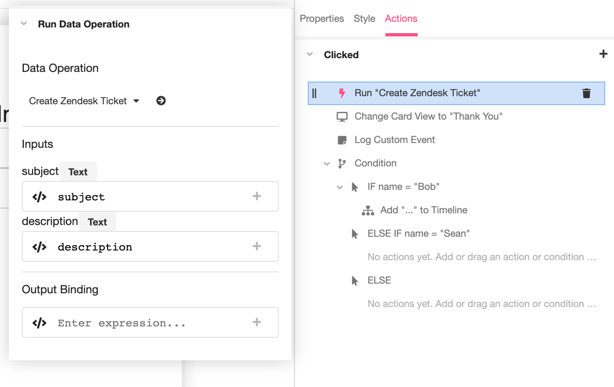

% Airkit Manual

# Airkit Book

Website: airkit-book.com

## ROUGH TOC

* [Introduction](#intro)
* Where to use Airkit
* [Advantages of Airkit over other platforms](#airkitAdvantages)
* [Journeys](#journeys)
* [Actors](#actors)
* Organizations
* [The Studio](#studio)
* [The Console](#console)
* [Builders](#builders)
* Deployments
* Resources
* Integrations
* Journey Builder
* App Builder
	* Components
* Connection Builder

## Introduction {#intro}

Airkit is a collection of tools that allow developers to create rich, omni-channel experiences for the last mile of customer interaction. Between the studio and infrastructure, Airkit is a set of tools for anyone who wants to create fantastic customer experiences.

### This Book

This book is designed to be a manual to help one get up and running with Airkit. We will discuss the framework and platform in a somewhat linear fashion building concepts on each other until we have a comprehensive understanding of the platform and Airkit applications. 

Building a book like this requires a ton of help. The Airkit platform is constantly improving as well. This may mean that certain parts of the book may become outdated. Please email zack@airkit.com or support@airkit.com with questions or errata.

###  Who is this book for?

This book is designed for people looking to learn about Airkit. Some sections will be less technical than others but in order to get the more complicated concepts some front end development experience may help. 

### Additional Resources

While this manual is a great place for understanding the basics of how to use Airkit, there are many additional resources on the platform. check out [The Support Site](https://support.airkit.com) for very up to date technical resources. This book will refer to pages on the site.

## Where to Use Airkit {#whyUseAirkit}

### Why is improving the customer experience so important? 

* “84% of companies that work to improve their customer experience report an increase in their revenue”
* “73% of companies with above average customer experience perform better financially then their competitors” 
* “96% of customers say customer service is important in their choice of loyalty to a brand” 
* “83% of companies believe it’s important to make customers happy also experience growing revenue” 
* “Customer-centric companies are 60% more profitable than companies that don’t focus on customers.” 
* “American consumers will pay 17% more to purchase from a company with a reputation for great service.” 

### What would you want to use Airkit for? 

* Streamlining a manual process, to make things easier and more efficient (i.e. filling out medical insurance forms)
* Taking an arduous process, like waiting on hold for a call center agent, and enabling the consumer to pick a day/time to be called back via an app
* Making more self service options available (i.e. to help people get onboarded, etc.)
* Automate a claims process

### What types of customers can use Airkit?

Any customer, across any industry, that wants to improve their customer experience. (However, a quote from Frank in my onboarding session, “Bank or insurance companies with 500-5,000 employees are Airkit’s sweet spot right now”). 

Some examples of Airkit customers:

* Skip the Dishes-During COVID, the need/want for food delivery service exploded. Skip the Dishes, which is a food delivery service, used Airkit to streamline their restaurant onboarding process.
* “Airkit provided us with an automated and digital onboarding experience for our partners by integrating with Salesforce. We’ve been able to transition over 50% of new restaurants to fully automated onboarding.” -Steve Purchala, SVP of Restaurants at Skip the Dishes
* When a new restaurant signs up with Skip the Dishes, Airkit automatically creates a record in Skip’s Salesforce database so their sales team can make sure that particular partner has everything they need to onboard successfully. 
* 80% of customer onboarding was done in a completely touchless manner
* 50% of new restaurants moved to fully automated onboarding
* 40% reduction in onboarding time
* 2X number of partners onboarded per month
* First Republic Bank “Our first app probably would have taken our team at least a couple of months to build on our own. With Airkit, we did it within 3 weeks.”

## Airkit Advantages {#airkitAdvantages}

## Journeys {#journeys}

As Airkit is built around dealing with the last mile of customer experiences, Airkit calls this last mile experience for each customer a "Journey." Each customer who uses your app will go through a journey. Journeys contain stateful information that is persisted across the different channels of web, text, and voice. Journeys even have their own variables and state stored in the session namespace.

To understand this better, let's look at a simple WISMO (Where is my Order) application, like the Digital Self Service example on the Airkit website. In the example, the user calls into a company to track their subscription to a coffee bean company. Each Journey needs to have a unique identifier. When I user starts a Journey with a phone call, the default journey identifier is the phone number of the user.

### Journey Identification

In the example discussed above, the journey was identified by the phone number of the user calling in. Not all journeys start with a phone number. Some journeys are entirely web based. It is possible to set up custom identifiers for a journey, but without any specification, each journey has unique id. This can be found in the [Session Scope](#sessionScope) under the `id` property. The term **session_id** is commonly used to refer to this value. Session Ids are useful when running [App API](@appApi) or trying to send events to particular sessions.

Journeys can also be identified by session keys. Keys can be set on a journey during the time of creation, through the [Airkit API](#airkitApi). These keys can also be used to identify the journey in Analytics as well as certain APIs.

#### Journey Identification Conflicts

When using an identifier, it is only possible to have one instance of the journey running at one time. This means if someone calls back into an Airkit number, should they resume the experience they were having before? The behavior for this is configured in [Configuration Builder](#configurationBuilder). Depending on the settings, if a conflicting Journey arises, the pre-existing journey can be continued, ended and new one started, or the new journey can be rejected.

## Actors {#actors}

Actors are the users of the Airkit Application. Actors have [journeys](#journeys) through an Airkit App. The actor also has unique data structure defined by all applications. It is possible to see the actor object by checking [Data Builder](#dataBuilder). The Default Identity Object, the type of Actor, has the following properties:

* first_name
* last_name
* full_name
* email
* phone
* time_zone

Not all actors will be required to have all of these properties, but if the Application starts a phone call or sends a text message, the current actor must have a phone number set. The actor is top level scoped variable. To set a phone number on the current actor, use the [Set Variable](#setVariableAction) action to set the `actor.phone` to the desired phone number. Because the actor then needs to be refreshed, it is also required to run the [Initialize Actor](#initializeActor) action as well. 

## The Studio {#studio}

Airkit Studio is the interface in which every detail of your Airkit apps can be created and edited. It is a complex web application with many different features. Most of the work of creating the Application is broken down into different [Builders](#builders). For full anatomy of the Studio, check out [this page](https://support.airkit.com/hc/en-us/articles/1500012238981-The-Anatomy-of-the-Studio).

## The Console {#console}

The console is an Organization based interface for managing Apps, Resources, Deployments and Users. Not all user roles have the same level of access to console. If you need to access a part that is mentioned here, please talk to your organization administrator.

## Builders {#builders}

### Journey Builder

### Connection Builder

#### App APIs {#appApi}

### Data Builder

### Configuration Builder {#configurationBuilder}

### Acton Builder {#actionBuilder}

#### Defining How Your Controls Interact

Action Builder is unlike other builders in that it exists in the inspector only and does not have a representation in the navigation section on the left side of the window. You can find the Action Builder under the Actions Tab in the inspector when you have an item selected in the Tree in App Builder. Not every component type will have Events. In the example below, Clicked is the Event that has two actions: Run "Create Zendesk Ticket" and Change Card View to "Thank You".

#### Action Picker

Clicking on the plus button the right of an Event or condition will present you with the Action Picker.

The left side of the Action Picker are the Categories of available actions. Select different items on the left to see the different available Actions for each Category. There is a complete list of actions by category at the bottom of this document.

Selecting an action will place at the bottom of the Action Chain.

#### Action Tree

The Action tree is where you can see all the actions for the Events on a control.

The tree can contain individual actions or condition statements. Actions can re-ordered and moved into and out condition statements by grabbing the handle at the left side of the action action. These actions will be run in a top down order, branching based on conditions.

#### Action Editor

Clicking on an Action in the Action Tree will present the action editor.

In the Action Editor you will be able to see all the configurations of the selected Action. Each different type of Action will have different options in its' Action Editor.

#### Available Actions

* Canvas Actions
	* Add Card - Add a New Card to the canvas
	* Update Card - Change the current card view
	* Remove Card - Remove the selected card from the canvas
	* Open Modal - Present another card as a modal
	* Close Modal - Dismiss the presented modal
* App
	* Run Data Operation - Run a single data operation
	* Run Data Operation Repeatedly - Run a data operation for each item in a data set
	* Set Variable - Assign a variable a new value
	* Initialize Actor - Set the actor
	* Set Identifier - Associate a unique identifier with this session
	* Run Event - Run a journey event
* Voice and Chat
	* Start Voice Bot - Start a voice bot with the current actor
	* Start Chat Bot - Start a new Chat Bot conversation with the current actor
* Action Tree
	* Condition - Group and run a set of actions when certain conditions are met
	* Create Timer - Schedule an action chain to run a later time
	* Cancel Timer - Cancel a scheduled timer
	* End Journey - End the current journey
* Reporting
	* Metic: Count - Create a counter
	* Metric: Field - Create a metric field
	* Metric: Statistic - Create a statistical metric
	* Metric: Start Timer - Create a timed metric and start it
	* Metric: Stop Timer - Stop a timer and record the time
	* Log Custom Event - Used to log a custom event with an Airscript expression

## Airscript

### Variable Scopes

#### Session Scope {#sessionScope}

## Airkit API {#airkitApi}