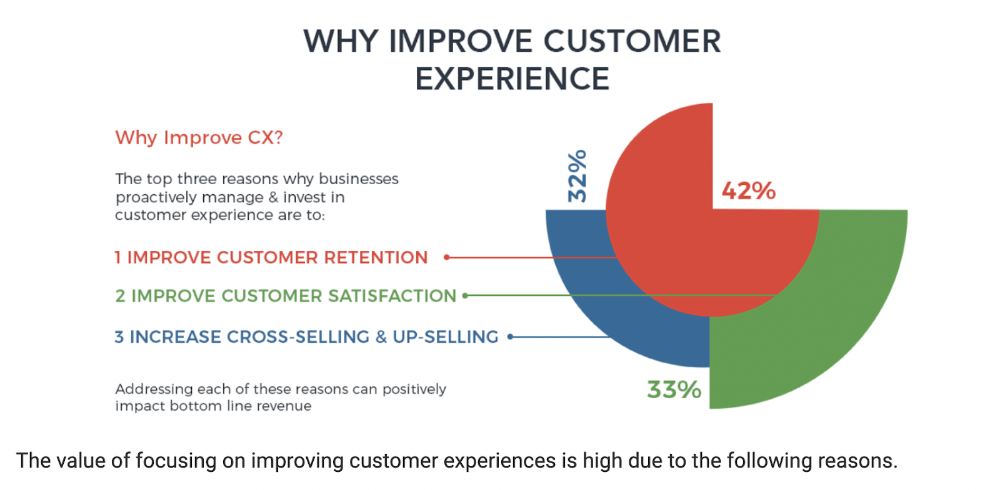

% Airkit Manual

# Airkit Book

Website: airkit-book.com

## ROUGH TOC

* [Introduction](#intro)
* [Where to use Airkit](#whyUseAirkit)
* [Advantages of Airkit over other platforms](#airkitAdvantages)
* [Journeys](#journeys)
* [Actors](#actors)
* Organizations
* [The Studio](#studio)
* [The Console](#console)
* [Builders](#builders)
* Deployments
* Resources
* [Integrations](#integrations)
* Journey Builder
* App Builder
	* Components
* Connection Builder

## Introduction {#intro}

Airkit is a collection of tools that allow developers to create rich, omni-channel experiences for the last mile of customer interaction. Between the studio and infrastructure, Airkit is a set of tools for anyone who wants to create fantastic customer experiences.

### This Book

This book is designed to be a manual to help one get up and running with Airkit. We will discuss the framework and platform in a somewhat linear fashion building concepts on each other until we have a comprehensive understanding of the platform and Airkit applications. 

Building a book like this requires a ton of help. The Airkit platform is constantly improving as well. This may mean that certain parts of the book may become outdated. Please email zack@airkit.com or support@airkit.com with questions or errata.

###  Who is this book for?

This book is designed for people looking to learn about Airkit. Some sections will be less technical than others but in order to get the more complicated concepts some front end development experience may help. 

### Additional Resources

While this manual is a great place for understanding the basics of how to use Airkit, there are many additional resources on the platform. check out [The Support Site](https://support.airkit.com) for very up to date technical resources. This book will refer to pages on the site.

## Where to Use Airkit {#whyUseAirkit}

### Why is improving the customer experience so important? 

* “84% of companies that work to improve their customer experience report an increase in their revenue”
* “73% of companies with above average customer experience perform better financially then their competitors” 
* “96% of customers say customer service is important in their choice of loyalty to a brand” 
* “83% of companies believe it’s important to make customers happy also experience growing revenue” 
* “Customer-centric companies are 60% more profitable than companies that don’t focus on customers.” 
* “American consumers will pay 17% more to purchase from a company with a reputation for great service.” 




### What would you want to use Airkit for? 

* Streamlining a manual process, to make things easier and more efficient (i.e. filling out medical insurance forms)
* Taking an arduous process, like waiting on hold for a call center agent, and enabling the consumer to pick a day/time to be called back via an app
* Making more self service options available (i.e. to help people get onboarded, etc.)
* Automate a claims process

### What types of customers can use Airkit?

Any customer, across any industry, that wants to improve their customer experience. (However, a quote from Frank in my onboarding session, “Bank or insurance companies with 500-5,000 employees are Airkit’s sweet spot right now”). 

Some examples of Airkit customers:

* Skip the Dishes-During COVID, the need/want for food delivery service exploded. Skip the Dishes, which is a food delivery service, used Airkit to streamline their restaurant onboarding process.
* “Airkit provided us with an automated and digital onboarding experience for our partners by integrating with Salesforce. We’ve been able to transition over 50% of new restaurants to fully automated onboarding.” -Steve Purchala, SVP of Restaurants at Skip the Dishes
* When a new restaurant signs up with Skip the Dishes, Airkit automatically creates a record in Skip’s Salesforce database so their sales team can make sure that particular partner has everything they need to onboard successfully. 
* 80% of customer onboarding was done in a completely touchless manner
* 50% of new restaurants moved to fully automated onboarding
* 40% reduction in onboarding time
* 2X number of partners onboarded per month
* First Republic Bank “Our first app probably would have taken our team at least a couple of months to build on our own. With Airkit, we did it within 3 weeks.”

## Airkit Advantages {#airkitAdvantages}

Airkit is different from every other competitor and building in house because:

* _Purpose Built_ Deliver 10x faster with 50+ reusable components
* _Connected_ Easily integrate with any system, out of the box or custom
* _Everywhere_ Orchestrate interactions across any channel, mobile, desktop, embeddables
* _Insights_ Click by click reporting to rapidly iterate and optimize
* _Reusability_ Templatize and standardize your digital experience
* _Enterprise Grade_ Security and scalability trusted by Fortune 50

### Internal Development vs. Airkit

* Reusability of templates allow you to accelerate development
* Omnichannel engagement (SMS, email, bots, voice)
* Modern integration framework 
* Time to build vs. in-house Engineering team - 20-30x faster (weeks vs. months/quarters)

### Low Code vs. No Code

* Airkit is a Low Code platform. 
* Low Code → accelerate developer/builder productivity 
* No Code → enable citizen developers

Low Code is better than No code because it allows for flexibility to fit many use cases, rather than very few pre built use cases. Low Code requires having a technical owner, which can create startup friction, but provides long term value.


#### Legacy Low Code Vs. Airkit (PowerApps, Outsystems, Appian, PegaSystems, Mendix)
Traditional Low Code applications were built for monolithic, internal enterprise applications. Some common examples:

* Field sales application to enter an order
* Internal team dashboards
* Long term portals for internal / customer logins

**Why Airkit?**

* Purpose built for episodic customer journeys
* Omnichannel engagement (SMS, email, bots, voice)
* Better developer experience
* Modern integration framework

#### No Code (Unqork, EasySend)

No Code platforms are built for the citizen developer. In theory, anyone can point and click to build an app from scratch without requiring any coding.

**Why Airkit?**

* No Code is inherently limiting
* Future proofing is not possible
* Citizen developers can be scary for Enterprise organizations


## Journeys {#journeys}

As Airkit is built around dealing with the last mile of customer experiences, Airkit calls this last mile experience for each customer a "Journey." Each customer who uses your app will go through a journey. Journeys contain stateful information that is persisted across the different channels of web, text, and voice. Journeys even have their own variables and state stored in the session namespace.

To understand this better, let's look at a simple WISMO (Where is my Order) application, like the Digital Self Service example on the Airkit website. In the example, the user calls into a company to track their subscription to a coffee bean company. Each Journey needs to have a unique identifier. When I user starts a Journey with a phone call, the default journey identifier is the phone number of the user.

### Journey Identification

In the example discussed above, the journey was identified by the phone number of the user calling in. Not all journeys start with a phone number. Some journeys are entirely web based. It is possible to set up custom identifiers for a journey, but without any specification, each journey has unique id. This can be found in the [Session Scope](#sessionScope) under the `id` property. The term **session_id** is commonly used to refer to this value. Session Ids are useful when running [App API](@appApi) or trying to send events to particular sessions.

Journeys can also be identified by session keys. Keys can be set on a journey during the time of creation, through the [Airkit API](#airkitApi). These keys can also be used to identify the journey in Analytics as well as certain APIs.

#### Journey Identification Conflicts

When using an identifier, it is only possible to have one instance of the journey running at one time. This means if someone calls back into an Airkit number, should they resume the experience they were having before? The behavior for this is configured in [Configuration Builder](#configurationBuilder). Depending on the settings, if a conflicting Journey arises, the pre-existing journey can be continued, ended and new one started, or the new journey can be rejected.

## Actors {#actors}

Actors are the users of the Airkit Application. Actors have [journeys](#journeys) through an Airkit App. The actor also has unique data structure defined by all applications. It is possible to see the actor object by checking [Data Builder](#dataBuilder). The Default Identity Object, the type of Actor, has the following properties:

* first_name
* last_name
* full_name
* email
* phone
* time_zone

Not all actors will be required to have all of these properties, but if the Application starts a phone call or sends a text message, the current actor must have a phone number set. The actor is top level scoped variable. To set a phone number on the current actor, use the [Set Variable](#setVariableAction) action to set the `actor.phone` to the desired phone number. Because the actor then needs to be refreshed, it is also required to run the [Initialize Actor](#initializeActor) action as well. 

## The Studio {#studio}

Airkit Studio is the interface in which every detail of your Airkit apps can be created and edited. It is a complex web application with many different features. Most of the work of creating the Application is broken down into different [Builders](#builders). For full anatomy of the Studio, check out [this page](https://support.airkit.com/hc/en-us/articles/1500012238981-The-Anatomy-of-the-Studio).


## The Console {#console}

The console is an Organization based interface for managing Apps, Resources, Deployments and Users. Not all user roles have the same level of access to console. If you need to access a part that is mentioned here, please talk to your organization administrator.

### Apps

Apps in console are a list of all the Apps in your organization. If an app is deployed and there is a launch trigger, it will appear next to the item. Select an Item in the App List to see the detailed information on it and launch it in [Studio](#studio).


These options include

* Edit in Studio - for opening the app in studio.
* Branches - see the branches for version control (advanced feature).
* Deployments - see the active deployments of the app.
* Reports - see all the reports that have been set up on the app.
* Activity - see a session log of all the sessions on the app.

### Datastores

Datastores are collections of AirData Tables of information. They are unique to your organization. Clicking on a Datastore will show the available AirData tables. Selecting a table from the list, will show which apps are using the data. Using this information it is possible to share custom data objects between different applications in your organization.

### Integrations {#consoleIntegrations}

Integrations is where one configures connections from the organization to the external sources of data. Integrations consist of an adapter, or piece of code that lives on the airkit system for connecting to an external system, and credentials, also known as Connected Accounts.

#### Connected Accounts

Each connected account represents a set of credentials to access an external set of data. There are many integrations, like Salesforce and Stripe that are built into the standard Airkit Deployment. These connected accounts can be used to create Connections in [Connection Builder](#connectionBuilder) that retrieves or sends data to these connected accounts. 

#### Custom Integrations

While Airkit comes with a bunch of built in integrations, it is possible to integrate with additional resources using custom integrations. The process of using a custom integration is first defining what the integration should look like in the custom integrations section and then adding a credential for the integration in the Connected Accounts section.

Currently supported custom integrations are:

* _OAuth 2.0_ Use OAuth and configure all the needed properties.
* _API Token_ Standard API token implementation.
* _HTTP Basic Auth_ Basic Username and password HTTP Auth.
* _Custom Token_ Specify a custom interface with a token.
* _SFTP_ Specify a username and password or private key for authentication.

### Resources

The resources tab in console is where you connect external resources like phone numbers, and websites. These resources can be used for different deployments of your applications. In order for a resource to be connected to your applications.

### Types of Resources

* Phone Numbers - can be used for voice and text messages.
* Domains - domains are the base of launch triggers.
* Routes - Using existing domains to define triggers for APIs.

Resources are similar to integrations but are used for these specific use cases. It is required to have an integration with a phone provider like Twilio to set up phone numbers.

### API

The API sections is where to configure external integrations into your Airkit app. If an external integration requires a web token, you can create one for your Organization under the API section. These tokens can then be used to reference your applications.

#### Tokens

TODO: More info here.

To create a token, click the new button on the top right and give it a name. The token will be displayed only at the time of creation. You will be able to use this token when connecting between external resources and Airkit with the [Airkit Public API](#airkitPublicApi). It is also possible to connect multiple Airkit Apps together in this fashion.

While it is still possible to use the API, it is more common to use standard App APIs now.

#### Webhooks

TODO: More info here.

Web hooks are used to create datasources and resources in your organization. They can be configured through this section.

### Settings

Settings is the section of the console used to manage the users and authentication in your organization.

#### Users

This is a list of active users in the organization. Each user has login information and a role. To update a user's role or information, or to delete a user. Select the user and deal perform your operations in the inspector on the right.

##### User Roles {#userRoles}

Different User roles have access to different parts of the Airkit Interface.

* _Agent_ This role is for people who will have the most minimal access to your organization.
* _Developer_ This role is for people who have access to build out applications in Airkit.
* _Owner_ This role is the person with the most control over the configuration of the organization. Ability to add resources and deployments and connect accounts.

##### User Variables

TODO: 

* User Variables and portals.

#### Invites

The way to add a new user to an Organization is through the Invites Tab. Creating an invite can be done with the New button in the top right. Selecting the _SSO Only_ checkbox will use the user's OAuth credentials (defined in the SAML section) to log in. Otherwise you will assign a username and the user will get to set a password when logging in.

See [User Roles](#userRoles) for more information about the different types of roles.

#### Organization

This section under settings is used to modify organization settings. You can see the organizations name, adjust the Authentication properties on the organization as well as modify white label settings.

#### SAML

Use this section to upload SAML file specifications for additional forms of logging into an app.

#### Notifiers

Specify Organization level notifications to go to specified people by email or phone.

## Builders {#builders}


### Journey Builder


### Connection Builder

#### App APIs {#appApi}

### Data Builder

### Configuration Builder {#configurationBuilder}

### Acton Builder {#actionBuilder}

#### Defining How Your Controls Interact

Action Builder is unlike other builders in that it exists in the inspector only and does not have a representation in the navigation section on the left side of the window. You can find the Action Builder under the Actions Tab in the inspector when you have an item selected in the Tree in App Builder. Not every component type will have Events. In the example below, Clicked is the Event that has two actions: Run "Create Zendesk Ticket" and Change Card View to "Thank You".


#### Action Picker

Clicking on the plus button the right of an Event or condition will present you with the Action Picker.


The left side of the Action Picker are the Categories of available actions. Select different items on the left to see the different available Actions for each Category. There is a complete list of actions by category at the bottom of this document.

Selecting an action will place at the bottom of the Action Chain.

#### Action Tree

The Action tree is where you can see all the actions for the Events on a control.


The tree can contain individual actions or condition statements. Actions can re-ordered and moved into and out condition statements by grabbing the handle at the left side of the action action. These actions will be run in a top down order, branching based on conditions.

#### Action Editor

Clicking on an Action in the Action Tree will present the action editor.


In the Action Editor you will be able to see all the configurations of the selected Action. Each different type of Action will have different options in its' Action Editor.

#### Available Actions

* Canvas Actions
	* Add Card - Add a New Card to the canvas
	* Update Card - Change the current card view
	* Remove Card - Remove the selected card from the canvas
	* Open Modal - Present another card as a modal
	* Close Modal - Dismiss the presented modal
* App
	* Run Data Operation - Run a single data operation
	* Run Data Operation Repeatedly - Run a data operation for each item in a data set
	* Set Variable - Assign a variable a new value
	* Initialize Actor - Set the actor
	* Set Identifier - Associate a unique identifier with this session
	* Run Event - Run a journey event
* Voice and Chat
	* Start Voice Bot - Start a voice bot with the current actor
	* Start Chat Bot - Start a new Chat Bot conversation with the current actor
* Action Tree
	* Condition - Group and run a set of actions when certain conditions are met
	* Create Timer - Schedule an action chain to run a later time
	* Cancel Timer - Cancel a scheduled timer
	* End Journey - End the current journey
* Reporting
	* Metic: Count - Create a counter
	* Metric: Field - Create a metric field
	* Metric: Statistic - Create a statistical metric
	* Metric: Start Timer - Create a timed metric and start it
	* Metric: Stop Timer - Stop a timer and record the time
	* Log Custom Event - Used to log a custom event with an Airscript expression

## Integrations {#integrations}

Airkit makes it easy to integrate your APIs and other systems with your applications. With all of your favorite platforms so accessible, you can consolidate existing processes as well as seamlessly combine different platforms’ functionalities in novel ways. Some of the most prevalent platforms, including Google, Zendesk, Salesforce, Stripe, and Twilio, come with streamlined connections pre-built into every application, but you’re not at all limited to the commonplace integrations. It’s possible to connect your Airkit apps to just about any system or external data source you like, whether you’re authenticating via OAuth, an API token, HTTP Basic Auth, a custom token, or SFTP. 

Airkit provides the ability to connect to your data, either through built in integrations such as Salesforce, or other external systems through custom integrations. These integrations enable users to query or transform data from events within an Airkit application and send data to your existing systems. For example, if you are looking to create an application to capture information for a support ticket, you can push data from Airkit to Zendesk or any other external systems you are able to set up an integration with. These integrations are extremely useful when looking to extend the capabilities of platforms that you already use today. Below are some guides on how to get started with connecting to your external systems. 

### Zendesk Integration: 

In the video below we walk you through setting up a simple app to create a Zendesk. In this video you will learn:

* How to create a simple form for gathering information from your customer
* How to create a web view with multiple card states
* How to use card level variables 
* Create a basic Zendesk ticket creation connection
* Hook the connection up to your submit button

[Zendesk Integration Video](https://youtu.be/AyfN2XT4ycc)

### Skip the Dishes Integration with Salesforce: 

SkipTheDishes integrates with Salesforce to keep track of digital onboarding journeys. 

SkipTheDishes, also referred to as Skip, coordinates meal delivery by connecting would-be diners with over twenty-seven thousand restaurants across Canada. Like many companies in this space, demand for their services rapidly expanded when COVID-19 hit, but they found themselves constrained by the lengthy sign-up flow restaurants needed to go through in order to work with Skip. 

Restaurant managers and owners work in the fast-paced, often unpredictable world of foodservice. Every moment counts, and there’s rarely a large enough block of uninterrupted time to complete a lengthy onboarding process in one fell swoop, particularly if said onboarding process is inefficient or unclear. Skip had always taken pains to make this process as simple for restaurant managers as possible, and this meant painstaking manual intervention: the team at Skip would regularly sort through different CRMs and databases in order to form a complete picture of where each restaurant was in their onboarding process, follow-up up appropriately, and and provide each customer with a tailored experience. With the spike in demand, however, the team at Skip quickly found themselves overwhelmed. They needed to find a way to maintain their personalized onboarding experience without requiring such high levels of manual research and intervention. 

Skip’s solution was to invest in a user-friendly, omnichannel way for restaurants to join their platform using Airkit. Via Airkit’s out-of-the-box Salesforce Integration, Skip built an onboarding app (capable of interfacing with restaurants via both web app and SMS) that connects restaurants’ onboarding information to Skip’s own Salesforce instance, automatically organizing each restaurants’ onboarding information in one place. This allows Skip’s sales team to keep track of where restaurants are in their journey and follow up as needed-and through Airkit, even some of this follow-up process was able to be automated. It’s fast and simple to set up Airkit  apps to read data from an external system in a recurring fashion and take actions-such as sending text or e-mail -accordingly. It’s through a combination of automatic updates and easily-tracked records on Salesforce that Skip now keeps its partners and sales teams in the loop throughout their onboarding processes. 

Perhaps most importantly, all of this was built out in a matter of months-Skip finalized their spec in May 2020, and their app was deployed the next month. Airkit’s out-of-the-box tools provide the power to rapidly streamline not only the integration of third-party systems, but their operations as well. 


## Airscript

Airscript is our own proprietary programming language used for working with data in many places in [The Studio](#studio). It is a language designed around the basics of working with data similar to excel functions.

### Query Expressions

Airscript includes some LINQ like syntax that allows you to operate on lists of items. This syntax looks somewhat similar to SQL but is based on a concept called Language Integrated Query ([LINQ](https://en.wikipedia.org/wiki/Language_Integrated_Query)).

Using this syntax you can filter or map a list of items.

The general syntax looks like the following:

```sql
FROM 
  item 
IN 
  collection 
WHERE 
  item.score > 80 
SELECT 
  item
```

In this simple example we go through a collection and filter out all items that have a score property greater than 80.

These expressions can be nested so you can complex things like:

```sql
FROM
  qualifiedPerson
IN
  FROM
	person
  IN
	collectionOfPoeple
  WHERE
	person.qualified = true
  SELECT
	person
WHERE
  qualifiedPerson.score > 80
SELECT
  qualifiedPerson
```

In this example we are pulling only qualified people out of a collection of people and then looking for people in that collection that have a score greater than 80.

Any valid Airscript function is valid within our syntax

```sql
FROM
  p
IN
  persons
WHERE
  STRING_FIND(p.name, "Bob") >= 0
SELECT
  p.name
```

This example is going through all persons and finding all persons who have a name that contains Bob in it. Then we are returning the name of those persons. This will return as a list of `p.name`

While this is the basic example of our syntax here, we have even more functionality baked into our syntax. The supported technical arguments are:

```sql
FROM 
	itemBinding = identifier, 
  [ indexBinding = identifier, [ collectionBinding = identifier ] ]
IN 
	expression 
[WHERE expression]
[ORDER_BY expression direction = (ASC | DESC)]
[LIMIT expression [OFFSET expression]]
SELECT [DISTINCT] selectExpression
```

Anything in [] means that it is optional. So we do not need to have a WHERE clause (even though my examples all have them). There is also an ORDER_BY clause and a LIMIT option. Also if you want your result to return only unique items you can put the distinct modifier on your select and you receive a SET with duplicate items removed instead of the array with multiples present.

One other important  note: there is an index binding, meaning that you can can also get the index of the item you are at in your iteration. For example:

```sql
FROM
  item, index
IN
  [{"foo": "bar"}, {"foo": "baz"}]
SELECT
  {"{{index}}": item}
```

In this case index is a special reserved word that you put the end of your expression and you can then refer to it in the rest of your statement. The result will be:

```
[
  {
	"0": {
	  "foo": "bar"
	}
  },
  {
	"1": {
	  "foo": "baz"
	}
  }
]
```

This syntax, combined with the full arrangement of Airscript functions has proven to be very helpful in the applications we have already built.

### Variable Scopes

In the studio and throughout your app, there are various different namespaces or scopes. This is a way of qualifying access to particular variables throughout your experience. The general best practice is to restrict your variable to least level of access you need in order to make your experience work. We will talk more about that below.

Some namespaces are editable and others are set at the beginning of the experience and cannot be modified.

#### High Level Scopes

On each journey there are some high level scopes:

_Session_ - Contains start parameters and session level variables.

_Profile_ - contains profile level configuration variables.

_Theme_ - contains theme level configuration.

_Activities_ - contains a list of all loaded activities.

_ActivityGroups_ - contains a list of all loaded activity groups.

_Configuration_ - Contains app specific configuration values.

Many of these high level scopes are used for app configuration and not really meant to be modified within your experience. The one main exception is Session where we can store variables that are able to accessed on any card, card view, bot, or event.

Note: While both Configuration and Profile scopes are modified in the configuration builder. The Configuration scope contains information about resources while Profile contains variables at the profile level.

#### Defining Session Level Variables

In the context of our apps, the term session and journey are interchangeable. Session or Journey level variables are set in the Journey builder. If you don’t see the Journey section on the right click anywhere on the stage.


Under variables you can click the plus and add session level variables. These variables will be available most places throughout the app, but remember they are not accessible within connection builder (you would need to pass them into a connection).

#### Working With Scopes Within Your Card Views
When working within your Cards and Card Views, you might want to create variables to store values throughout your application. In general the flow of the variable scoping looks like this:

* Session (Journey) - accessible Everywhere.
	* Activity Group (Web Flow)- accessible to all web flows within the activity group.
		* Activity (Web Page) - accessible only on the on the current web page.


As mentioned above, the general best practice is to try to store you variables at the lowest scope. This will ensure the highest level of reusability of your web pages and web flows.

See types for information selecting the correct variable type.

To access a variable in a particular scope, for example in creating the text for a label, you put in the *scope.variableName* in the expression editor.


#### Working With Scopes Within Events

Events have their own scope as they do not exist within the context of a particular card. You can set variables on events by selected the Event Source in Journey Builder and adding variables. When you fire an event you can pass in values to the variable.


#### Working With Scopes Within Custom Controls

When building custom controls, you are able to define what inputs or data is available to the control. During the design of your custom control, any defined inputs will be available on the control context. For example, if your custom control has an input named title, then control.title is how you’d reference that variable within the control.

As you implement your custom control, you can pull variables from the session, activityGroup, or activity contexts.

#### Working With Scopes Within Connections

Connections exist as independent steps. They have access to all the inputs passed in but do not have access to things like session, even if they are run from a session. Also, future data operations have access to all the outputs created by previous data operations. This means that if you create a transform in the first step. You can still access the return value of that transform in the 5th step without having to do anything special.

#### Profile Variables

Your app can contain different profiles. Each profile has a unique set of values and resources associated with them. Talking about profiles in general is a whole different topic, but let's talk about how to create a profile level variable and modify it.

Go to Journey Builder and start like you would be creating a session level variable.


Once you have the variable created, right click on it. Select Convert To Setting from the dropdown.


The little symbol next to the variable name indicates that it is a profile level variable. Once you’ve set it to a profile variable, we can adjust the value of the profile variable in Configuration Builder. Scroll down the bottom until you see App Settings, you can insert a value in the value section.


You can change the value of configVar for each different app profile. You can then use this variable throughout your cards as profile.configVar. Profile variables have the same access restrictions as session level variables.

#### Session Scope {#sessionScope}

## Airkit API {#airkitApi}